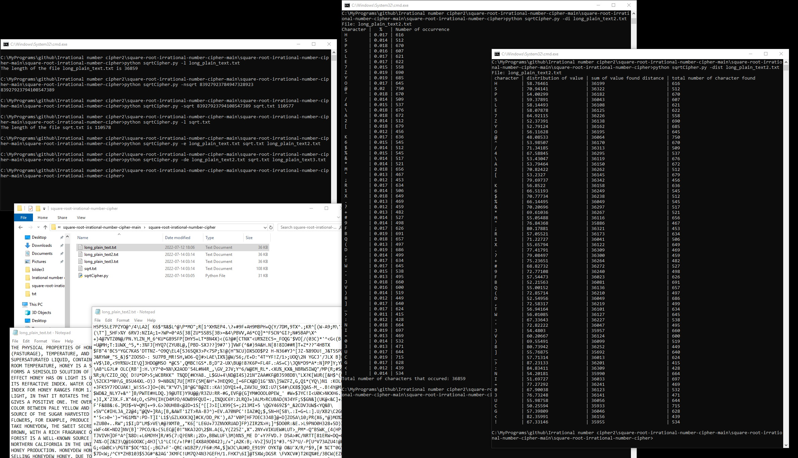

# square-root-irrational-number-cipher

Cipher that uses a key that is an irrational number, known as irrational cipher. The irrational number is from the square root of a non-square number.

Written by philip0000000 <br>
Find the project here [https://github.com/philip0000000/OldFileFormatToXML] <br>
Program has been successfully tested on Windows 10 and Ubuntu 22.04 LTS with Python 3.10.

## Information

The author of the program is not an expert in cryptographer. Relying on the encryption of this program, for real world sensitive data is not advised as the program has not yet been thoroughly tested against cryptographic attacks. This program was made by the author to learn more about irrational numbers and about encryption.

The idea of the program is to use the one-time pad[1]. But with a key that is much shorter then the plain text data that is going to be encrypted or vice versa, ciphertext to plaintext. One solution to this problem is stream ciphers[2]. This program, instead of using a stream cipher for generating the key, is using a irrational number[3].

The benefits of using irrational number compared to stream cipher for a key is:
1. The author, suspect some irrational numbers, not all, are more random then the numbers generated by stream ciphers. The reason for this is that stream chiper can go in a loop when generating a key. This remark needs more investigation.
2. Some irrational numbers(like the square root of non-square numbers) can be more easily understood when generating, then to generate stream ciphers numbers, which are more complex. Usually a more secure stream cipher needs a more complex algorithm.
3. There may exist backdoors in stream ciphers, by the author of the stream chiper, this is not the case for irrational numbers.

The drawback of using irrational number compared to stream cipher for a key is:
1. Encrypting with an irrational number should be slower than with stream cipher.

The program cipher works with irrational numbers from square root. All non-perfect square numbers if calculated the square root of, will yield a irrational number. This has been proven[4] and gives an endless supply of irrational numbers. The irrational number will then be exclusive or[5] with the plain text, corresponding needed numbers for character. If the key is sufficiently random then using logic xor is good enough for good security[6].

## Usage

When choosing the number to use for generating the square root number, it is advised to use the command:
```
sqrtCipher.py -nsqrt
```
As this will generate the N-th non-square number, if one does not use this option, there is a chance one may pick a number that is not irrational if applyed the square root. To generate a non-square number, an interesting algorithm was used[7].

The irrational number must be 3x larger than the plaintext in length, that will be encrypted. The reason for this is that 2 decimal numbers are used for 1 character, generating 3 decimal numbers instead of just 2 is just for extra safety if there is some weird thing when encrypting the plain text. To see the size of a file, use the command:
```
sqrtCipher.py -l
```

For generating square root of a number with the amounted needed digits, use the command:
```
sqrtCipher.py -sqrt
```

To encrypt plaintext, use the command:
```
sqrtCipher.py -e
```

To decrypt the ciphertext, use the command:
```
sqrtCipher.py -de
```

To check that the encryption is good, to prevent frequency analysis attack, the key and the ciphertext should be sufficiently random. There are two values that must be correct for defending against this:
1. That there exist the same amount of all characters. To check this in a file, use this command:
```
sqrtCipher.py -di
```
2. That the characters are evenly spaced out, from each other. As a sequence like 0000011111 passes the test for number 1., it is still bad. A better sequence would be 1010101010, as such a frequency is more random. To check this on a file, use this command:
```
sqrtCipher.py -dist
```

#### Example:
1. Get length of file
```
python sqrtCipher.py -l long_plain_text.txt
36859   # 36859 * 3 = 110577 (length of square root number)
```
2. Get random non-square number
```
python sqrtCipher.py -nsqrt 83927923784947328923
83927923794108547389
```
3. Get the square root value
```
python sqrtCipher.py -sqrt 83927923794108547389 sqrt.txt 110577
```
4. Check that the square root value is correct length
```
python sqrtCipher.py -l sqrt.txt
110578
```

5. Encrypt:
```
python sqrtCipher.py -e long_plain_text.txt sqrt.txt long_plain_text2.txt
```
6. Decrypt:
```
python sqrtCipher.py -de long_plain_text2.txt sqrt.txt long_plain_text3.txt
```

#### Check that the encryption is good
1. check count in encrypted file. Encrypted file should have the same amount of characters for every character(1/63 = 0.015).
```
python sqrtCipher.py -di long_plain_text2.txt
```
2. check the cluster. should be evenly clustered
```
python sqrtCipher.py -dist long_plain_text2.txt
```



#### Schizophrenic number
Schizophrenic numbers[8] are numbers that show a specific pattern when calculating the square root of. One should avoid using these numbers. The formula to calculate schizophrenic numbers is:
```
f(n) = 10 f(n − 1) + n with the initial value f(0) = 0
```
One can also get some kind of schizophrenic numbers(not really, more pseudo schizophrenic numbers) by repeating "123456790". As for example the sqrt of 123456790123456790123456790123456790123456790123456790123456790123456790123456790123456790123456790123456790123456790123456790123456790123456790123456790123456790123456790123456790123456790123456790123456790123456790123456790123456790123456790123456790123456790123456790123456790123456790123456790123456790123456790123456790123456790 is:
```
11111111111111111111111111111111111111111111111111111111111111111111111111111111111111111111111111111111111111111111111111111111111111111111111111111111111111111111111.111111111111111111111111111111111111111111111111111111...
```
These numbers are not recomended to use as a key when encrypting.

## License

Licensed under the MIT license.

## Reference

[1] https://en.wikipedia.org/wiki/One-time_pad <br>
[2] https://en.wikipedia.org/wiki/Stream_cipher <br>
[3] https://en.wikipedia.org/wiki/Irrational_number <br>
[4] https://www.quora.com/Are-all-non-perfect-square-numbers-square-roots-irrational-And-if-so-whats-the-proof-for-that <br>
[5] https://en.wikipedia.org/wiki/Exclusive_or <br>
[6] https://crypto.stackexchange.com/questions/47/with-sufficient-randomness-is-xor-an-acceptable-mechanism-for-encrypting <br>
[7] https://www.jstor.org/stable/3618253?seq=1 <br>
[8] https://en.wikipedia.org/wiki/Schizophrenic_number <br>
